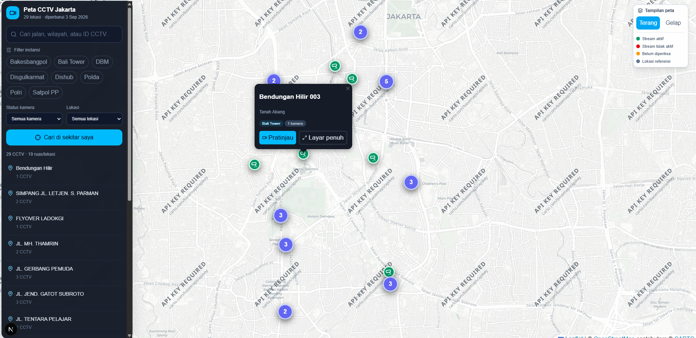
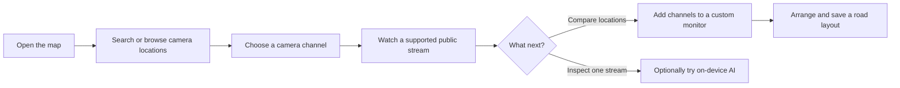
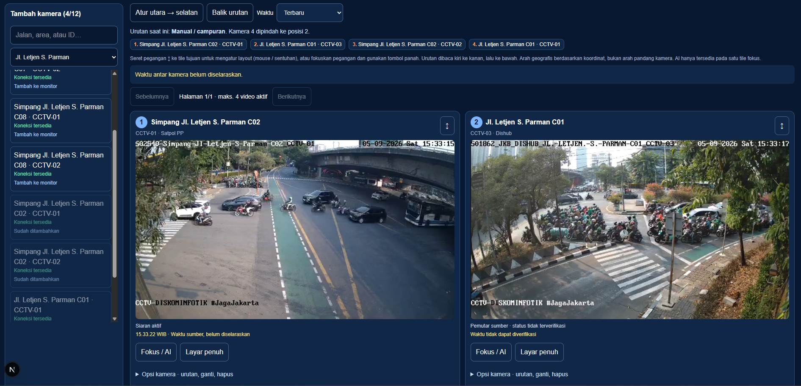
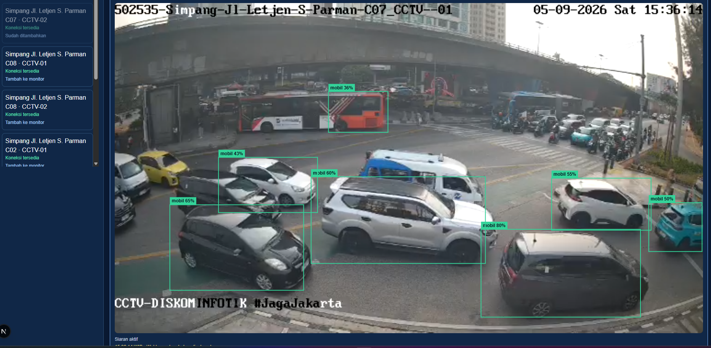
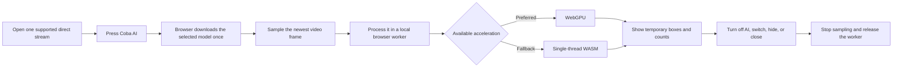
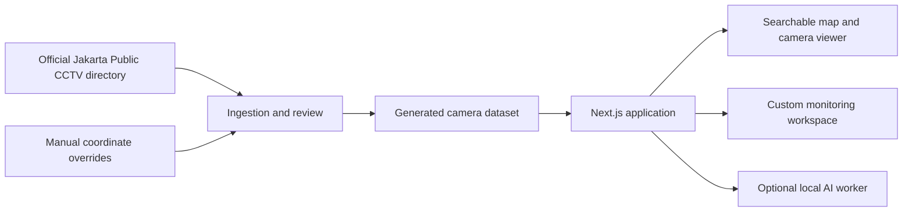

# Jakarta CCTV Map

**A simpler way to explore Jakarta's public CCTV cameras.** Find a road, open a camera, and build a personal monitoring view for the places that matter to you.

Jakarta CCTV Map presents public CCTV listings and streams in a searchable map and a flexible monitoring workspace. It is an independent interface for publicly available camera listings and streams - not an official government service.

> **Live demo:** [jakarta-cctv-map.vercel.app](https://jakarta-cctv-map.vercel.app/)



## Data source

Camera names, agencies, channel links, and public stream URLs come from the [Jakarta Public CCTV directory](https://jakcctv.jakarta.go.id/publik). Because that directory does not provide map coordinates, this repository keeps a reviewed coordinate dataset and excludes newly found locations from the map until they are checked. Camera operators control stream availability and source-data accuracy.

## What this project helps you do

This project brings together practical tools for exploring public cameras:

- **See cameras on a map** with location clusters for easier exploration.
- **Search naturally** by road, area, agency, or camera ID.
- **Watch your way** with a saved, custom monitoring layout for a road or route.
- **Compare several views at once** in two-, four-, or experimental six-camera layouts.
- **Experiment with on-device object detection** on one open stream without uploading video frames.

## Start here: find and watch a camera

No account is needed.

1. Open the map and search for a road, district, agency, or camera ID.
2. Select a marker to see the available camera channels at that location.
3. Open a preview to watch a supported public stream.
4. Use **Kamera di dekat saya** if you want cameras near your current location. Your browser will ask permission first.

Camera availability depends on the upstream provider. A stream may be offline, delayed, or prevent embedding without notice.

### How it works



## Multi-CCTV monitoring

Create a personal monitoring workspace for several points along a road, corridor, or regular journey.



### How to monitor several cameras

1. From a map popup, camera viewer, or road group, choose **Tambah ke monitor** for each channel you want.
2. Open **Buka monitor**. Choose **Atur** to add cameras, edit the name, save, change layout or arrange the tiles. An empty workspace opens these settings automatically.
3. Optionally filter the workspace to a standardised road name, then choose **Mulai monitor**.
4. Drag a tile's **↕** handle onto another tile (mouse or touch), or focus the handle and use the arrow keys. **Atur utara → selatan** sorts geographically; **Balik urutan** reverses the current layout. The current direction and numbered list update immediately. Geographic order does not describe the camera's viewing direction.
5. Save one named layout locally in your browser and return to it later. **Mulai monitor** closes settings and expands the grid; **Atur** reopens them without restarting the streams.

While watching, the toolbar shows one group timing status. Open it for timing details and excluded cameras. **Fokus** enlarges a camera; **Opsi kamera** contains fullscreen, retry, ordering, replacement/removal and source information. AI remains an explicit opt-in inside the focused view. The numbered order list and instructions are under **Daftar & bantuan urutan** in arrangement mode.

| Layout | Best for | Notes |
| --- | --- | --- |
| Two cameras | A quick comparison | Works well on desktop and mobile. |
| Four cameras | Monitoring an intersection or route | Desktop-friendly. |
| Six cameras | A broader corridor | Experimental; use a capable desktop device. |

Only the streams on the current page load. On mobile, playback is limited to two cameras to keep the page responsive. Pausing, switching tabs, closing the workspace, or removing a camera releases playback resources.

Before starting or while paused, visible tiles request a single `preview.jpg` directly from their known public Bali Tower stream origin. There is no automatic refresh or video download for previews. Snapshots can be old: their timestamps and camera availability are not verified. Failed or unsupported previews display an explanation; you can still start the stream. Off-page and background tiles do not mount preview images.

The navy/blue interface and orange accents are inspired by [the official +Jakarta color identity](https://www.jakarta.go.id/informasi-kolaborasi) (Biru Abang and Jingga Bis Kota), with interface-specific shades. This is not an official Jakarta government application.

**Live timing:** **Sinkron otomatis** runs by default while monitoring is visible. It starts from the slowest advancing HLS program time within the shared playable buffer, then adjusts faster players in the background. Stalled cameras or streams without usable metadata are excluded; synchronization is best-effort, not proof that source clocks or on-screen timestamps are correct. **Terbaru** is a manual opt-out. **Ke siaran terbaru** resets playback toward live without disabling automatic sync. Hidden tabs still release playback resources.

## Optional AI: object-detection experiment

For supported direct streams, **Coba AI** can highlight traffic-related objects in the camera currently open: people, bicycles, cars, motorcycles, buses, and trucks.

### AI model in brief

The experiment uses a YOLO26 object-detection model exported to the browser-friendly ONNX format. It recognises common COCO traffic classes rather than Jakarta-specific events or behaviours. Choose a smaller Nano model for faster results, or Small/Medium on a more capable device for potentially more detail; every result remains an estimate.



- It is **off by default** and starts only after you press **Coba AI**.
- Video frames stay on your device: they are processed in a browser worker, not sent to this app's server, recorded, or retained.
- It runs on one focused camera only. Turn it off before changing model settings to free device memory.
- Results are experimental and can be wrong. Do not use them for enforcement, emergency response, or public-safety decisions.

The application prefers WebGPU when your browser supports it and uses a single-thread WASM fallback otherwise. Nano FP16 is the default model; Nano INT8 is typically the lightest option for CPU/WASM, while Small and Medium can improve detail on faster devices.

### Object detection: user flow



Frames stay in the browser throughout this flow; the application server does not receive or store them.

## Privacy and data

Your location is requested only when you select the nearby-camera feature. It stays in the browser for that session and is not stored by this project.

Map tiles and camera streams come directly from third-party providers, which receive ordinary network information such as an IP address under their own policies. This project does not archive CCTV footage. When AI is enabled, frames and detections remain on the device as described above.

## For developers

### Tech stack

- **Framework:** Next.js 16, React 19, TypeScript, and Tailwind CSS
- **Map and search:** React Leaflet, Leaflet, Supercluster, and CARTO raster tiles
- **Video and monitoring:** HLS.js with browser-managed playback and local layout storage
- **Optional AI:** ONNX Runtime Web with a YOLO26 model, using WebGPU or WASM in a browser worker
- **Data and quality:** TypeScript ingestion and validation tools, Vitest, ESLint, and GitHub Actions

### Run locally

**You need:** [Node.js](https://nodejs.org/) 22 or later and npm. Create your local environment file before starting:

```bash
cp .env.example .env.local
npm ci
npm run dev
```

In PowerShell, use `Copy-Item .env.example .env.local` instead of `cp`.

Then open [http://localhost:3000](http://localhost:3000).

The repository includes a generated camera snapshot, so the application can build without fetching camera data. Map tiles and live streams still need a network connection at runtime.

### Configure CARTO map tiles

Request a **basemap API key** from [CARTO](https://carto.com/basemaps/apikey/) and place it in `.env.local`:

```dotenv
CARTO_BASEMAP_API_KEY=your_basemap_key_here
```

Restart the development server after changing the key. Do not commit it. `CARTO_API_ACCESS_TOKEN` remains accepted as an alias only when its value is a basemap key; an account API token is a different credential. The application keeps the key on the server-side tile route rather than exposing it to browser code.

| Variable | Required | Purpose |
| --- | --- | --- |
| `CARTO_BASEMAP_API_KEY` | Yes, for map tiles | Server-side CARTO basemap key. |
| `NEXT_PUBLIC_ENABLE_CCTV_AI` | No | Set to `true` only after preparing local AI model assets. Defaults to `false`. |

For Docker Compose, put the variable in `.env` (Compose does not automatically read `.env.local`) and run:

```bash
docker compose up --build
```

The Compose environment enables the AI experiment for local verification. Build the optimized production image with `docker build -f Dockerfile.vercel .`.

### Enable the AI experiment locally

The separately licensed YOLO model is not committed or downloaded during normal installation. To prepare it locally:

```powershell
Copy-Item .env.example .env.local
# Set NEXT_PUBLIC_ENABLE_CCTV_AI=true in .env.local
py -m pip install -r tools/ai-models/requirements.txt
py tools/ai-models/export-yolo26n.py
npm run dev
```

The exporter creates content-hashed ONNX assets and a model catalog under `public/models/yolo26n`. Review Ultralytics licensing and each camera operator's terms before deployment.

Choose packaged model variants for Docker with these variables before `docker compose up --build`:

| Setting | Values | Default |
| --- | --- | --- |
| `AI_MODEL_VARIANT` | `all`, `nano`, `small`, `medium` | `all` |
| `AI_MODEL_PRECISION` | `all`, `fp32`, `fp16`, `int8` | `all` |
| `AI_MODEL_IMAGE_SIZE` | An integer such as `320`, `416`, or `640` | `320` |

For a non-Docker export:

```powershell
py tools/ai-models/export-yolo26n.py --variant all --precision all --imgsz 320
```

### Refresh camera data

Camera metadata and stream links are collected only from the official [Jakarta Public CCTV](https://jakcctv.jakarta.go.id/publik) directory. Coordinates are manually reviewed and maintained because the directory does not provide map coordinates.

To normalise names without fetching or replacing reviewed URLs and coordinates:

```bash
npx tsx tools/camera-data/normalize-names.ts
```

To ingest and validate data:

```bash
npm run ingest
npm run validate-data
npm run validate-streams
```

Locations are resolved from manually reviewed entries in [`data/manual/overrides.json`](data/manual/overrides.json), then from the previous generated dataset. New unresolved sites go to [`data/review/unresolved-locations.json`](data/review/unresolved-locations.json) and are not put on the map until reviewed. Do not edit [`data/generated/cameras.json`](data/generated/cameras.json) directly.

### Project structure

```text
src/
  app/                   Next.js pages and API route adapters
  domain/cameras/        Shared camera types, schemas, and pure logic
  features/cameras/      Map, search, viewer, and stream availability checks
  features/monitoring/   Custom layouts, playback coordination, and saved state
  features/detection/    Browser AI controls, overlays, and inference worker
  features/video/        Direct HLS video playback
data/
  generated/             Committed camera dataset used by the application
  manual/                Reviewed coordinate overrides
  review/                Locations awaiting manual verification
tools/
  camera-data/           Ingestion, normalisation, and validation scripts
  ai-models/             YOLO26 ONNX model export
  build/                 Browser runtime asset preparation
```

### Architecture at a glance



- `src/features/cameras/` contains the explorer, map, viewer, location lookup, and stream checks.
- `src/features/monitoring/` contains layouts, ordering, playback coordination, and locally saved workspace state.
- `src/features/detection/` contains the browser-side model catalog, inference worker, and overlays.
- `tools/camera-data/` ingests and validates the source directory; `tools/ai-models/` prepares ONNX web assets.

### Checks

```bash
npm run validate-data
npm run lint
npm test
npm run build
```

### Deploy to Vercel

This repository includes [`Dockerfile.vercel`](Dockerfile.vercel). Vercel detects it automatically and deploys the container, including the optional browser AI assets.

1. Push the repository to GitHub, then import it from the [Vercel dashboard](https://vercel.com/new).
2. In **Environment Variables**, add `CARTO_BASEMAP_API_KEY` for **Production** (and **Preview** if you want map tiles in preview deployments).
3. Keep the default project settings; do not add a custom build or output command.
4. Deploy. Pushes to the production branch create production deployments; other branches receive preview URLs.

The scheduled camera-data refresh workflow was intentionally removed. Refresh, review, and commit camera data from a trusted local or CI workflow before deploying it.

## Contributing

Corrections and improvements are welcome. Read [CONTRIBUTING.md](CONTRIBUTING.md) for the development workflow, coordinate-correction process, and pull-request checklist.

## Cite this project

If you use this repository in research, a report, or another project, please cite the repository and include the commit or release you used:

```bibtex
@software{rasidin_2026_jakarta_cctv_map,
  author  = {Rasidin, Said},
  title   = {Jakarta CCTV Map},
  year    = {2026},
  url     = {https://github.com/said-rasidin/jakarta-cctv-map},
  note    = {Accessed: 2026-09-05. Commit or release: <your-version>}
}
```

## License and attribution

Except for third-party materials described below, this project is licensed under the [Creative Commons Attribution 4.0 International License](LICENSE.md).

Camera listings and public stream links originate with the [Jakarta Public CCTV](https://jakcctv.jakarta.go.id/publik) directory. Video feeds remain the property of their respective owners and are not covered by this project's license. OpenStreetMap, CARTO, dependencies, and other third-party material remain subject to their own licenses and terms.
