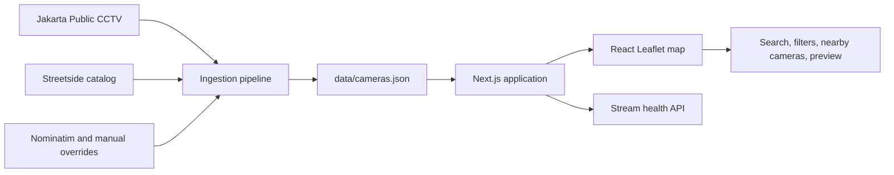

# Jakarta CCTV Map

An interactive map for finding and viewing public CCTV cameras across Jakarta.

The application turns Jakarta's public camera directories into a searchable map. Users can search by road, district, agency, or camera ID; filter cameras by agency; find cameras near their current location; and preview supported live streams.

> **Live demo:** Coming soon. The application is planned for deployment on Vercel.


## Features

- Interactive Jakarta map with clustered camera markers
- Search by road, district, agency, or camera ID
- Agency-based camera filters
- Nearby-camera discovery using browser geolocation
- Multi-channel selection for supported camera locations
- On-demand live-stream previews and availability checks
- Light and dark map styles

## Data sources

Camera metadata is collected from two public sources:

- [Jakarta Public CCTV](https://jakcctv.jakarta.go.id/publik) provides the directly embeddable CCTV streams. The ingestion script extracts camera IDs, location names, agencies, and stream URLs from this directory.
- [Streetside camera catalog](https://streetside.mugnimaestra.dev/) provides additional public camera locations and coordinates. It is also used to improve the coordinates of matching cameras from the Jakarta CCTV directory.

When a direct-stream location cannot be matched to the Streetside catalog, its coordinates are resolved in this order:

1. A manually reviewed entry in [`data/overrides.json`](data/overrides.json)
2. Coordinates from the last successfully generated dataset
3. Geocoding through [OpenStreetMap Nominatim](https://nominatim.openstreetmap.org/)

Generated camera data is committed to [`data/cameras.json`](data/cameras.json), while locations that still need manual review are written to [`data/unresolved-locations.json`](data/unresolved-locations.json). The map tiles use OpenStreetMap data rendered by [CARTO](https://carto.com/attributions).

This project is an independent interface for publicly available data. Camera ownership, stream availability, and upstream data accuracy remain under the control of their respective providers. Review the upstream providers' terms before redistributing their data.

## High-level design



- **Data pipeline:** `scripts/ingest.ts` fetches and normalizes the source catalogs, groups multiple channels at the same site, resolves coordinates, and writes a versioned JSON dataset.
- **Application:** Next.js loads the generated dataset at build time. The interactive React UI performs searching, filtering, distance sorting, and map interaction in the browser.
- **Map:** React Leaflet renders CARTO map tiles, while Supercluster groups dense camera markers for responsive navigation.
- **Streams:** Direct Bali Tower streams are loaded only when requested. A server-side API route checks approved stream hosts before the viewer reports availability.
- **Automation:** GitHub Actions validates every change and refreshes the camera dataset daily. The refresh job keeps the last good dataset if an upstream source returns suspiciously little data.

## Run locally

### Requirements

- [Node.js](https://nodejs.org/) 22 or later
- npm

Install dependencies and start the development server:

```bash
npm ci
npm run dev
```

Open [http://localhost:3000](http://localhost:3000).

The repository already contains a generated camera dataset, so an internet connection is not required to build the application itself. Map tiles and live camera streams still require network access at runtime.

### Production build

```bash
npm run build
npm start
```

### Docker

Build and run the production image with Docker Compose:

```bash
docker compose up --build
```

The application will be available at [http://localhost:3000](http://localhost:3000).

## Deploy to Vercel

The public deployment is not available yet. To create one:

1. Import this repository into [Vercel](https://vercel.com/).
2. Keep the detected Next.js framework settings and default build command.
3. Deploy the `main` branch.
4. Add the production URL to the **Live demo** section at the top of this README.

The scheduled GitHub Actions refresh is separate from Vercel. Add a repository variable named `NOMINATIM_CONTACT_EMAIL` containing a valid operational email address before enabling the `Refresh camera dataset` workflow.

## Refresh the camera data

Copy `.env.example` to `.env.local` and replace the placeholder with a descriptive user agent containing a real contact address, as required by the [Nominatim usage policy](https://operations.osmfoundation.org/policies/nominatim/):

```env
NOMINATIM_USER_AGENT=peta-cctv-jakarta/0.1 (contact: you@example.com)
```

Load the environment variable into your shell, then run:

```bash
npm run ingest
npm run validate-data
npm run validate-streams
```

The ingestion script reads `NOMINATIM_USER_AGENT` from the process environment; it does not automatically load `.env.local`. On PowerShell, for example:

```powershell
$env:NOMINATIM_USER_AGENT = "peta-cctv-jakarta/0.1 (contact: you@example.com)"
npm run ingest
```

Review unresolved locations after ingestion. Add verified coordinates to [`data/overrides.json`](data/overrides.json) using the camera site ID as the key, then run the ingestion again. Manual overrides always take precedence over cached or geocoded coordinates.

## Quality checks

Run the same checks used in continuous integration:

```bash
npm run validate-data
npm run lint
npm test
npm run build
```

`npm run validate-streams` performs network requests to upstream cameras and is therefore kept separate from the standard CI checks.

## Known limitations

- Some catalog locations do not provide a directly embeddable stream.
- Public streams can be offline, slow, or blocked from embedding without notice.
- Coordinates obtained through geocoding may be approximate and should be manually reviewed.
- Nearby-camera discovery requires browser location permission.
- The application interface is currently in Indonesian, although this documentation is in English.
- Map tiles, camera catalogs, and streams depend on third-party services outside this project's control.

## Privacy

The application does not store a user's location. Browser geolocation is requested only after the user selects the nearby-camera feature and remains in client-side memory for that session.

Map tiles and camera streams are loaded from external providers. Those providers receive ordinary network information, such as the user's IP address, according to their own privacy policies. This project does not record or archive CCTV footage.

## Contributing

Corrections and improvements are welcome. See [`CONTRIBUTING.md`](CONTRIBUTING.md) for the development workflow, data-correction process, and pull request checklist.

Please do not edit `data/cameras.json` directly. For incorrect camera coordinates, add a verified correction to `data/overrides.json` and regenerate the dataset.

## License and attribution

Except for third-party materials described below, this project is licensed under the [Creative Commons Attribution 4.0 International License](LICENSE.md).

The Streetside aggregated camera directory used by this project is published under CC BY 4.0. Required attribution:

> Camera directory by [Streetside Jakarta](https://streetside.mugnimaestra.dev/), CC BY 4.0. Underlying CCTV feeds: DKI Jakarta Provincial Government, via the Molecool API.

The underlying video and image feeds remain the property of their respective owners and are not covered by this project's license. OpenStreetMap, CARTO, dependencies, and other third-party materials remain subject to their own licenses and terms.
