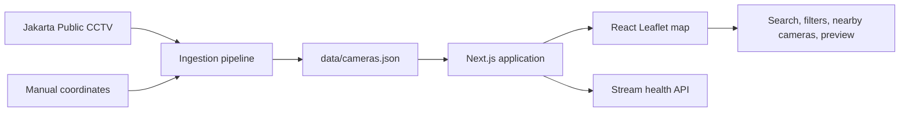
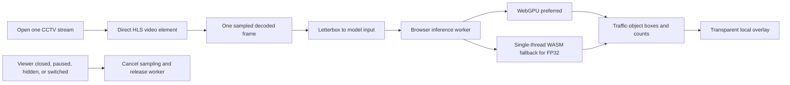

# Jakarta CCTV Map

An interactive map for finding and viewing public CCTV cameras across Jakarta.

The application turns Jakarta's official public CCTV directory into a searchable map. Users can search by road, district, agency, or camera ID; filter cameras by agency; find cameras near their current location; and preview supported live streams.

> **Live demo:** Coming soon. The application is planned for deployment on Vercel.


## Features

- Interactive Jakarta map with clustered camera markers
- Search by road, district, agency, or camera ID
- Agency-based camera filters
- Nearby-camera discovery using browser geolocation
- Multi-channel selection for supported camera locations
- On-demand live-stream previews and availability checks
- Opt-in, client-side YOLO26n object detection for the camera currently open
- Light and dark map styles

## Data sources

Camera metadata and stream links are collected only from the official [Jakarta Public CCTV](https://jakcctv.jakarta.go.id/publik) directory. The ingestion script extracts camera IDs, location names, agencies, and public iframe URLs from that page.

The official directory does not include map coordinates. Coordinates in this repository are manually extracted, reviewed, and maintained in [`data/overrides.json`](data/overrides.json); they are not fetched from a third-party camera catalogue.

Coordinates are resolved in this order:

1. A manually extracted and reviewed entry in [`data/overrides.json`](data/overrides.json)
2. A manually maintained coordinate from the last successfully generated dataset

Newly listed sites without a manual coordinate are placed in [`data/unresolved-locations.json`](data/unresolved-locations.json) and are not published on the map until reviewed.

Generated camera data is committed to [`data/cameras.json`](data/cameras.json), while locations that still need manual review are written to [`data/unresolved-locations.json`](data/unresolved-locations.json). The map tiles use OpenStreetMap data rendered by [CARTO](https://carto.com/attributions).

This project is an independent interface for publicly available data. Camera ownership, stream availability, and upstream data accuracy remain under the control of their respective providers. Review the upstream providers' terms before redistributing their data.

## High-level design



- **Data pipeline:** `scripts/ingest.ts` fetches and normalizes the official public directory, groups multiple channels at the same site, applies manually maintained coordinates, and writes a versioned JSON dataset.
- **Application:** Next.js loads the generated dataset at build time. The interactive React UI performs searching, filtering, distance sorting, and map interaction in the browser.
- **Map:** React Leaflet renders CARTO map tiles, while Supercluster groups dense camera markers for responsive navigation.
- **Streams:** Direct Bali Tower streams are loaded only when requested. A server-side API route checks approved stream hosts before the viewer reports availability.
- **AI experiment:** A direct HLS player samples at most one frame at a time and runs YOLO26n in a browser worker. Frames are not uploaded, recorded, or retained. WebGPU is preferred with a single-thread WASM fallback.
- **Automation:** GitHub Actions validates every change and refreshes the camera dataset daily. The refresh job keeps the last good dataset if an upstream source returns suspiciously little data.

## Run locally

### Requirements

- [Node.js](https://nodejs.org/) 22 or later
- npm

Install dependencies and start the development server:

```bash
npm ci
npm run dev
```

Open [http://localhost:3000](http://localhost:3000).

The repository already contains a generated camera dataset, so an internet connection is not required to build the application itself. Map tiles and live camera streams still require network access at runtime.

### Optional local YOLO26n experiment

The separately licensed model is not committed or downloaded during a normal app install. To enable **Coba AI**, install the pinned Python export dependencies and generate the web asset:

```powershell
Copy-Item .env.example .env.local
# Set NEXT_PUBLIC_ENABLE_CCTV_AI=true in .env.local
py -m pip install -r requirements-ai.txt
py scripts/export-yolo26n.py
npm run dev
```

The exporter creates a content-hashed, static 416×416 ONNX model plus its validated manifest under `public/models/yolo26n`. The first click downloads the model into the browser cache; AI stops and its worker/session are released when disabled, hidden, switched, or closed. Review Ultralytics licensing and the camera operator's terms before deployment.

## How AI works

The AI mode is opt-in. It never loads a model, records video, or sends pixels to the application server until the viewer presses **Coba AI** for the currently open camera.



Only one frame can be in inference at a time. The sampler starts at roughly 1 frame/second and adapts between 0.5 and 3 FPS, prioritizing smooth video playback. The initial COCO labels shown are person, bicycle, car, motorcycle, bus, and truck. Results are ephemeral and experimental.

### Choose a YOLO26 experiment

Compose packages one selected model per image. Set these environment variables before `docker compose up --build`; use `--build` whenever any selection changes.

| Setting | Values | Default | Notes |
| --- | --- | --- | --- |
| `AI_MODEL_VARIANT` | `nano`, `small`, `medium` | `nano` | Larger variants generally trade more download, memory, and latency for accuracy. |
| `AI_MODEL_PRECISION` | `fp32`, `fp16` | `fp32` | FP16 requires a browser with WebGPU; it deliberately has no WASM fallback. |
| `AI_MODEL_IMAGE_SIZE` | integer, e.g. `320`, `416`, `640` | `416` | A larger square input improves small-object detail at a memory/latency cost. |

PowerShell examples:

```powershell
# Small FP32: compatible with WebGPU and WASM fallback
$env:AI_MODEL_VARIANT = "small"
$env:AI_MODEL_PRECISION = "fp32"
docker compose up --build

# Medium FP16: experiment only on a WebGPU-capable browser
$env:AI_MODEL_VARIANT = "medium"
$env:AI_MODEL_PRECISION = "fp16"
$env:AI_MODEL_IMAGE_SIZE = "416"
docker compose up --build
```

For the non-Docker exporter, pass the same selection explicitly:

```powershell
py scripts/export-yolo26n.py --variant small --precision fp32 --imgsz 416
```

The manifest shown by the viewer identifies the selected variant and precision. Select FP32 first for baseline correctness and compatibility; use FP16 only to benchmark WebGPU-capable devices.

### Production build

```bash
npm run build
npm start
```

### Docker

Build and run the production image with Docker Compose:

```bash
docker compose up --build
```

The application will be available at [http://localhost:3000](http://localhost:3000).

The Compose build automatically installs the pinned Python AI dependencies, exports the selected YOLO26 variant to the content-hashed ONNX web asset, and copies the ONNX Runtime browser files. It then starts `npm run dev` with the AI experiment enabled, so no host Python or Node setup is needed for local verification. A regular `docker build .` still produces the optimized production image.

## Deploy to Vercel

The public deployment is not available yet. To create one:

1. Import this repository into [Vercel](https://vercel.com/).
2. Keep the detected Next.js framework settings and default build command.
3. Deploy the `main` branch.
4. Add the production URL to the **Live demo** section at the top of this README.

The scheduled GitHub Actions refresh is separate from Vercel and can update the committed dataset independently of a Vercel deployment.

## Refresh the camera data

Run:

```bash
npm run ingest
npm run validate-data
npm run validate-streams
```

Review unresolved locations after ingestion. Add verified coordinates to [`data/overrides.json`](data/overrides.json) using the camera site ID as the key, then run the ingestion again. Manual coordinates always take precedence over the previously generated dataset.

## Quality checks

Run the same checks used in continuous integration:

```bash
npm run validate-data
npm run lint
npm test
npm run build
```

`npm run validate-streams` performs network requests to upstream cameras and is therefore kept separate from the standard CI checks.

## Known limitations

- Public streams can be offline, slow, or blocked from embedding without notice.
- HLS playback and AI capture require full-chain CORS support; the viewer falls back to the public iframe and disables AI if direct playback fails.
- YOLO detections are experimental and may be wrong. They must not be used for enforcement or public-safety decisions.
- Manually extracted coordinates may be approximate and should be corrected through the review process.
- Nearby-camera discovery requires browser location permission.
- The application interface is currently in Indonesian, although this documentation is in English.
- Map tiles, camera catalogs, and streams depend on third-party services outside this project's control.

## Privacy

The application does not store a user's location. Browser geolocation is requested only after the user selects the nearby-camera feature and remains in client-side memory for that session.

Map tiles and camera streams are loaded from external providers. Those providers receive ordinary network information, such as the user's IP address, according to their own privacy policies. This project does not record or archive CCTV footage.

When explicitly enabled, object detection runs on the user's device for only the open camera. Frames and detections are not sent to this application's server or stored by the application.

## Contributing

Corrections and improvements are welcome. See [`CONTRIBUTING.md`](CONTRIBUTING.md) for the development workflow, data-correction process, and pull request checklist.

Please do not edit `data/cameras.json` directly. For incorrect camera coordinates, add a verified correction to `data/overrides.json` and regenerate the dataset.

## License and attribution

Except for third-party materials described below, this project is licensed under the [Creative Commons Attribution 4.0 International License](LICENSE.md).

Camera listings and public stream links come from the [Jakarta Public CCTV](https://jakcctv.jakarta.go.id/publik) directory. The underlying video and image feeds remain the property of their respective owners and are not covered by this project's license. OpenStreetMap, CARTO, dependencies, and other third-party materials remain subject to their own licenses and terms.
